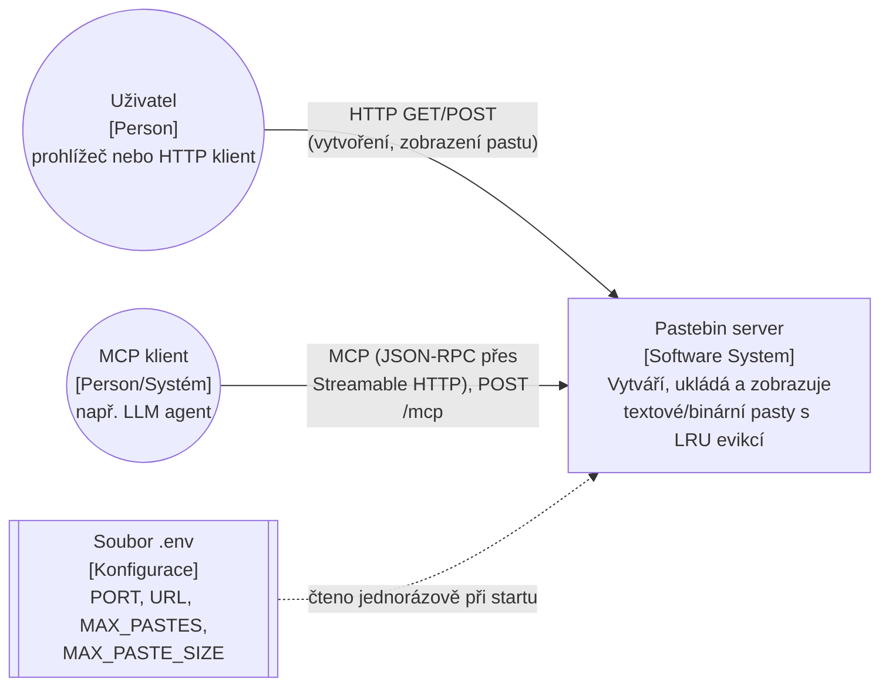
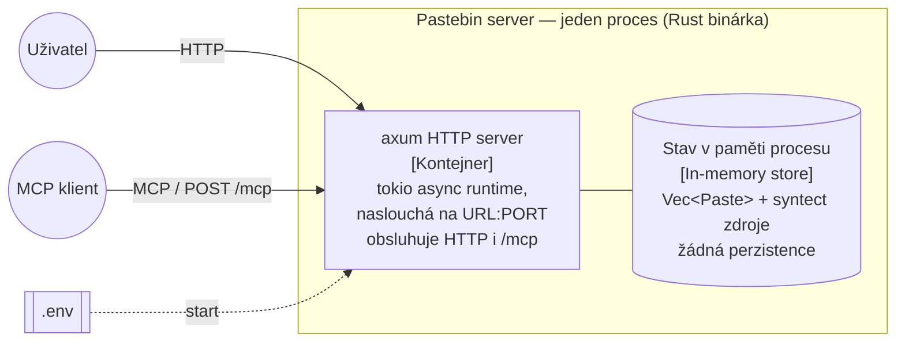
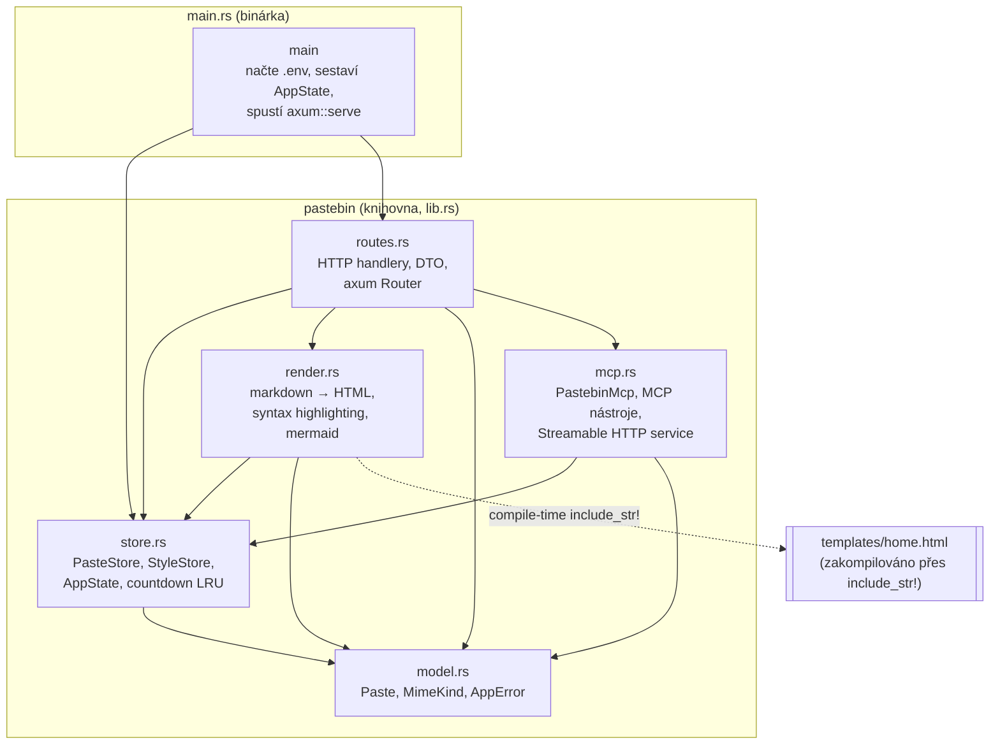
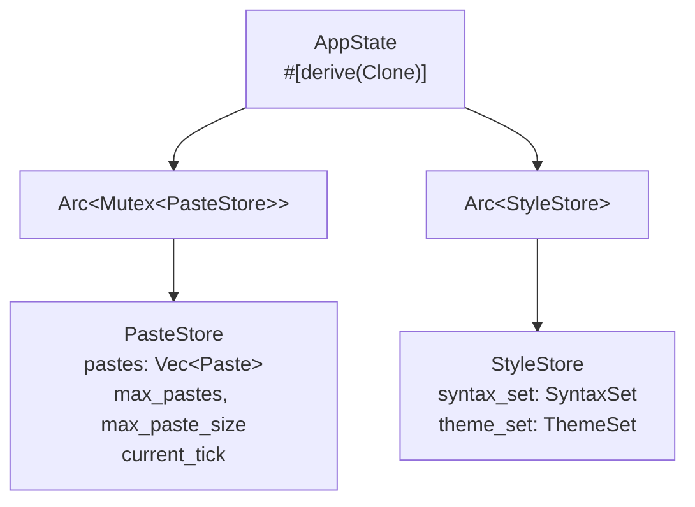

# Architektura a návrh — Pastebin server

Navazuje na [`docs/requirements.md`](./requirements.md). Popisuje aktuální architekturu tak, jak je implementována — moduly, jejich závislosti, vlastnictví stavu a aplikaci návrhových vzorů. Jednotlivá netriviální rozhodnutí jsou zaznamenána samostatně v [`docs/adr/`](./adr/).

## 1. C4 — Kontext (úroveň 1)

Systém jako černá skříňka a jeho okolí.

Systém má od zavedení MCP serveru dva typy vnějších aktérů se dvěma různými protokoly (běžné HTTP a Model Context Protocol), ale pořád jde o jeden a ten samý software systém — oba protokoly obsluhuje stejný proces nad stejnou doménou. Žádné další externí závislosti — žádnou databázi, žádnou frontu, žádnou externí síťovou službu. Rendering markdownu, zvýrazňování syntaxe (`syntect`), generování SVG z mermaid diagramů (`mermaid-svg`) i zpracování MCP protokolu (`rmcp`) probíhá čistě in-process, bez volání ven.

## 2. C4 — Kontejnery (úroveň 2)

Protože jde o jeden binární proces bez oddělených nasaditelných jednotek (žádná databáze, cache, reverse proxy), je tato úroveň prakticky degenerovaná na jediný kontejner. Zobrazena je hlavně kvůli explicitnímu zaznamenání této vlastnosti — je to záměr, viz [NFR-3, NFR-4 v requirements.md](./requirements.md#3-nefunkční-požadavky-nfr) a [ADR 0002](./adr/0002-vec-only-storage.md).

Restart procesu = ztráta veškerého obsahu (žádný svazek, žádná databáze). To je zdokumentovaný, ne opomenutý důsledek (NFR-3). MCP server neběží jako samostatný proces ani na jiném portu — je to `.nest_service("/mcp", ...)` namontovaný do toho samého axum `Router`, takže stále jde o jediný kontejner.

## 3. C4 — Komponenty (úroveň 3)

Moduly uvnitř binárky (`src/`) a jejich závislosti. Šipky odpovídají skutečným `use crate::...` importům v kódu.

Vlastnosti tohoto grafu, ověřené proti importům v kódu:

- **Bezcyklický** — `model.rs` nemá žádnou vnitřní závislost (jen externí crates `uuid`, `serde`, `axum`, `mermaid_svg`), `store.rs` závisí jen na `model.rs`, `render.rs` a `mcp.rs` závisí na `model.rs` a `store.rs` (`render.rs` jen na `store::StyleStore`, `mcp.rs` na `store::AppState`), `routes.rs` závisí na všech ostatních.
- **`render.rs` nezávisí na `PasteStore`** — bere jen `&Paste` a `&StyleStore` (obyčejná data, žádný zámek, žádné hledání podle UUID). To je záměrný výsledek refaktoru popsaného v [ADR 0004](./adr/0004-pastestore-as-repository.md) — rendering je čistě funkce nad daty, ne nad úložištěm.
- **`routes.rs` nikdy nesahá na `PasteStore.pastes` přímo** — pracuje výhradně přes veřejné metody (`insert`, `record_view`), nikoli přes `Vec<Paste>` samotný. `store.rs` tak funguje jako repository (viz [ADR 0004](./adr/0004-pastestore-as-repository.md)), přestože pro něj neexistuje samostatný soubor.
- **`mcp.rs` je druhý, nezávislý spotřebitel `PasteStore`** — volá přesně ty samé veřejné metody (`insert`, `record_view`) jako `routes.rs`, ne duplicitní logiku. Na rozdíl od `routes.rs` ale vůbec nezávisí na `render.rs` — obsah pastu vrací jako surový text, ne přes strategy-pattern rendering (viz [ADR 0006](./adr/0006-mcp-as-separate-adapter.md)).
- **`mcp.rs` má pro binární obsah jiné řešení než `routes.rs`** — `routes.rs` má `POST /paste/binary` s `Bytes` extraktorem (syrové bajty), `mcp.rs` má samostatný nástroj `create_binary_paste` s base64 stringem (`base64` crate). Není to nekonzistence v kódu, je to důsledek toho, že MCP je celé JSON-RPC — žádný nástroj nemůže dostat syrové bajty jako argument, protože JSON string musí být validní Unicode (viz [ADR 0008](./adr/0008-base64-mcp-binary-tool.md)).
- Žádný modul kromě `render.rs` a `routes.rs` nezná `axum::response`/HTTP typy, s výjimkou `model.rs` (kde `AppError` implementuje `IntoResponse` — to je hranice, na které se doménová chyba mapuje na protokol). `mcp.rs` mapuje `AppError` na text (`format!("{:?}", e)`), ne na HTTP status — má tedy vlastní, oddělenou hranici pro chyby (JSON-RPC `isError`, ne HTTP kód).
- **`routes.rs` má tři různé způsoby, jak z requestu dostat `content`** — `Json<CreatePasteDto>`, `Form<CreatePasteDto>` a (pro `POST /paste/binary`) přímo `axum::body::Bytes`, beze zprostředkujícího DTO typu. Poslední cesta je jediná, která obchází `String`/UTF-8 a podporuje skutečně libovolná binární data (viz [ADR 0007](./adr/0007-dedicated-binary-endpoint.md)). Volba mimetype/limitu se pak i tak řeší jen v `store.rs` (`PasteStore::insert` → `max_content_size`), `routes.rs` nikde sám nerozhoduje, jaký limit platí.
- **`post_paste_binary` čte metadata (název souboru) mimo tělo requestu** — `Bytes` extraktor vezme jen tělo, takže původní název souboru se posílá vedle, v hlavičce `X-File-Name-B64` (base64, protože hlavičky jsou ASCII-only, ale název souboru může být libovolný Unicode). `model::sanitize_file_name` sjednocuje čištění vstupu mezi touto HTTP cestou a MCP nástrojem `create_binary_paste` (viz [ADR 0009](./adr/0009-original-file-name-preservation.md)).

## 4. Vlastnictví stavu (ownership)

Aktuální graf vlastnictví:

- `AppState` je `Clone` (klonuje se jen `Arc`, ne data uvnitř) a předává se do axum přes `State<AppState>` — každý handler dostane vlastní kopii dvou `Arc` ukazatelů, ne kopii dat.
- `PasteStore` je jediná mutable sdílená struktura v aplikaci — chráněná `std::sync::Mutex`. Veškerý zápis (vytvoření pastu, evikce, `record_view`) prochází výhradně přes tento jeden zámek — bez ohledu na to, jestli přišel z `routes.rs`, nebo z `mcp.rs`.
- `StyleStore` je po konstrukci (`StyleStore::new()` v `main.rs`) neměnný — `SyntaxSet`/`ThemeSet` se načtou jednou při startu a dál se jen čtou. Proto je zabalený jen v `Arc`, bez `Mutex` — nesdílí zámek s `PasteStore`, takže renderování (potenciálně pomalejší operace — parsování markdownu, syntax highlighting, generování SVG) neblokuje zápisy/čtení do `PasteStore` a naopak.
- `PastebinMcp` (v `mcp.rs`) drží vlastní pole `state: AppState` — tedy stejné dva `Arc` ukazatele jako `routes.rs`, ne kopii dat ani oddělený stav. `mcp_service` vytváří novou instanci `PastebinMcp` pro každou MCP session přes factory closure (`move || Ok(PastebinMcp::new(state.clone()))`), ale protože klonování `AppState` je jen klonování dvou `Arc`, všechny instance napříč všemi sezeními pořád ukazují na ten samý `PasteStore`/`StyleStore`.

## 5. Souběžnost

- Zámek `PasteStore` se získává vždy jen na dobu nutnou k operaci nad `Vec<Paste>` (`insert`, `record_view`) — v `routes::get_paste` handler zavolá `paste_store.record_view(uuid)?`, čímž zapíše `hits`/`last_seen_tick`, a teprve poté (se zámkem stále drženým, protože `paste` je `&Paste` půjčené z `MutexGuard`) volá `render::render_paste_page`. Renderovací funkce samy o sobě zámek nedrží ani neznají — ale protože `paste` je reference odvozená z `MutexGuard`, zámek zůstává držený i po dobu renderování markdownu/syntaxe/mermaidu, dokud handler nedoběhne. To je zdokumentovaný kompromis, viz Otevřené otázky níže.
- V testovém i produkčním kódu (`insert`, `post_paste_json`/`post_paste_form`) se zámek získává, provede se operace a zámek se pustí na konci scope handleru — žádné volání `.await` neprobíhá s zámkem drženým uvnitř `store.rs`/`render.rs` funkcí samotných (`transform_md`, `render_paste_page` jsou synchronní).
- `#[tokio::test]` v testech (`render.rs`, `tests/routes_test.rs`) běží defaultně na `current_thread` runtime — testy, které drží `MutexGuard` přes volání `app.oneshot(...).await` (na stejném `Arc<Mutex<PasteStore>>`, co router používá), by se zablokovaly (viz `drop(paste_store)` komentáře v `tests/routes_test.rs` — nutnost uvolnit zámek explicitně před requestem je zdokumentovaná přímo v testu).
- `#[tool]` metody na `PastebinMcp` (`create_paste`, `get_paste`) jsou synchronní funkce, ne `async fn` — zamykají `self.state.paste_store` stejným způsobem jako handlery v `routes.rs` (`.lock().unwrap()`, žádné `.await` s drženým zámkem). MCP requesty a HTTP requesty tak soupeří o přesně ten samý `Mutex` — žádný oddělený lock ani fronta jen pro MCP.

## 6. Přehled ADR

| ADR | Rozhodnutí | Status |
|---|---|---|
| [0001](./adr/0001-record-architecture-decisions.md) | Zaznamenávat architektonická rozhodnutí formou ADR | Accepted |
| [0002](./adr/0002-vec-only-storage.md) | Úložiště pastů výhradně přes `Vec`, žádné asociativní kolekce | Accepted |
| [0003](./adr/0003-tick-based-countdown-lru.md) | Countdown LRU řízené globálním tickem (`last_seen_tick`), ne pozicí ve vektoru | Accepted |
| [0004](./adr/0004-pastestore-as-repository.md) | `PasteStore` jako repository bez samostatné `repository.rs` vrstvy | Accepted |
| [0005](./adr/0005-dual-post-endpoints.md) | Dva oddělené POST endpointy (JSON/form) místo jednoho s content-negotiation | Accepted, revidovatelné |
| [0006](./adr/0006-mcp-as-separate-adapter.md) | MCP server jako samostatný modul (`mcp.rs`) se Streamable HTTP transportem, ne uvnitř `routes.rs` | Accepted |
| [0007](./adr/0007-dedicated-binary-endpoint.md) | Vyhrazený `POST /paste/binary` (extraktor `Bytes`) a oddělené limity velikosti `max_paste_size`/`max_file_size` | Accepted |
| [0008](./adr/0008-base64-mcp-binary-tool.md) | Base64 pro binární obsah v MCP (`create_binary_paste`) místo syrových bajtů | Accepted |
| [0009](./adr/0009-original-file-name-preservation.md) | Zachování původního názvu souboru (`Paste.file_name`, hlavička `X-File-Name-B64`, MCP `file_name` argument) a frontend fallback po vytvoření `OctetStream` pastu | Accepted |
| [0010](./adr/0010-github-actions-ci-docker-image.md) | CI/CD přes GitHub Actions (build+test na push/PR, Docker image na push do `main`) a publikace do GHCR, bez `docker-compose.yml` | Accepted |
