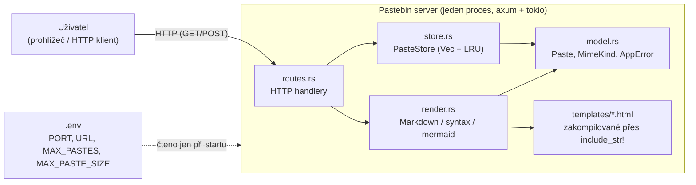

# Požadavky a analýza — Pastebin server

## 1. Doménový slovník (Ubiquitous Language)

| Pojem | Definice |
|---|---|
| **Paste** | Jedna uložená položka obsahu identifikovaná pomocí `Uuid` (`model::Paste`). Obsahuje binární data (`content: Vec<u8>`), typ obsahu (`mimetype`), počítadlo zobrazení (`hits`) a časovou známku poslední aktivity (`last_seen_tick`). |
| **MimeKind** | Enum popisující typ obsahu pastu: `PlainText`, `Html`, `Markdown`, `OctetStream`. Řídí, jak se paste renderuje (strategy pattern přes `match`). |
| **PasteStore** | Sdílený stav aplikace držící všechny pasty ve `Vec<Paste>` (`store::PasteStore`). Vlastní i konfiguraci kapacity (`max_pastes`, `max_paste_size`) a globální generační počítadlo (`current_tick`). |
| **StyleStore** | Neměnná sada zdrojů pro renderování (`syntect::SyntaxSet`, `syntect::ThemeSet`), sdílená přes `Arc` bez zámku, protože se po startu aplikace nemění. |
| **AppState** | Kombinace `Arc<Mutex<PasteStore>>` a `Arc<StyleStore>`, předávaná do axum routeru přes `State`. |
| **Hits** | Počítadlo "životů" pastu (`u32`). Zvyšuje se při každém zobrazení (`record_view`), snižuje se o 1 při každém pokusu o evikci, dokud nedosáhne nuly. |
| **Tick (generace)** | Monotónně rostoucí `u64` čítač v `PasteStore` (`current_tick`). Zvyšuje se jak při vytvoření pastu, tak při každém zobrazení; hodnota se zapisuje do `last_seen_tick` daného pastu. Slouží k určení, který paste byl naposledy "viděn" nejdéle. |
| **Countdown LRU (decrement-LRU)** | Vlastní evikční algoritmus nad `Vec`: najde se paste s nejnižším `last_seen_tick` mezi zatím nevyřazenými kandidáty, jeho `hits` se sníží o 1; pokud klesnou na 0, paste se odstraní; pokud ne, kandidát se dočasně přeskočí (`skip_mask`) a hledá se další nejstarší, dokud se něco neuvolní. |
| **Kapacita (MAX_PASTES)** | Maximální počet pastů, které smí `PasteStore` držet současně. Konfigurováno přes `.env`. |
| **Limit velikosti (MAX_PASTE_SIZE)** | Maximální povolená velikost `content` jednoho pastu v bajtech. Konfigurováno přes `.env`, vynucováno na dvou různých místech (viz kapitola Otevřené otázky). |
| **AppError** | Doménový chybový enum (`model::AppError`) implementující `IntoResponse`, mapující chyby na HTTP stavové kódy. |
| **Render strategie** | Funkce `render::render_paste_page`, která podle `MimeKind` vybere způsob vykreslení odpovědi (strategy pattern, žádné trait objekty). |

## 2. Funkční požadavky

| ID | Požadavek |
|---|---|
| FR-1 | Systém umožní vytvořit nový paste odesláním JSON těla na `POST /paste/json` s poli `content: string` a `mimetype: MimeKind`. Odpověď obsahuje nově vygenerované `Uuid` pastu. |
| FR-2 | Systém umožní vytvořit nový paste odesláním `application/x-www-form-urlencoded` těla na `POST /paste/form` se stejnými poli jako FR-1. |
| FR-3 | Systém při vytvoření pastu vygeneruje náhodné `Uuid` (v4) a přidělí mu aktuální generaci (`current_tick`). |
| FR-4 | Systém zpřístupní existující paste na `GET /paste/{uuid}`. Pokud paste s daným UUID neexistuje (nikdy nevznikl nebo byl evikován), vrátí `404`. |
| FR-5 | Při každém úspěšném zobrazení pastu (FR-4) systém zvýší jeho `hits` o 1 a nastaví `last_seen_tick` na novou generaci (`record_view`). |
| FR-6 | Systém vykreslí obsah pastu podle `MimeKind`: `PlainText` → `text/plain` beze změny; `Html` → `text/html` beze změny (bez sanitizace); `Markdown` → převod na HTML; `OctetStream` → binární stažení s hlavičkou `Content-Disposition: attachment; filename="{uuid}.bin"`. |
| FR-7 | Pro `Markdown` systém převede text na HTML pomocí `pulldown-cmark`, včetně základního formátování (nadpisy, tučné/kurzíva, seznamy, tabulky, přeškrtnutí, chytrá interpunkce, úkolové seznamy). |
| FR-8 | Uvnitř markdownu systém rozpozná blok kódu s jazykem a obarví ho pomocí `syntect` (motiv "Solarized (light)", inline styly). |
| FR-9 | Uvnitř markdownu systém rozpozná blok s jazykem `mermaid` a vyrenderuje ho na SVG pomocí `mermaid-svg`, vloženém přímo do výsledného HTML. |
| FR-10 | Systém zobrazí na `GET /` statickou domovskou stránku s formulářem pro vytvoření pastu (textové pole obsahu, výběr `mimetype`); formulář odesílá JSON na `/paste/json`. |
| FR-11 | Pokud počet pastů v `PasteStore` dosáhne `max_pastes`, systém před vložením nového pastu provede countdown LRU evikci (viz doménový slovník), dokud se neuvolní alespoň jedno místo. |
| FR-12 | Systém odmítne vytvoření pastu s prázdným `content` (`AppError::BadRequest`, `400`). |
| FR-13 | Systém odmítne vytvoření pastu, jehož `content` přesahuje `max_paste_size` (`AppError::PayloadTooLarge`, `413`). |
| FR-14 | Systém odmítne request s neplatnou hodnotou `mimetype` (nerozpoznaný enum variant) už na úrovni deserializace (axum/serde), bez zásahu do stavu úložiště. |

## 3. Nefunkční požadavky (NFR)

| ID | Požadavek | Poznámka |
|---|---|---|
| NFR-1 | Kapacita úložiště je konfigurovatelná přes `MAX_PASTES` v `.env`; aktuální provozní hodnota je `100`. | Hodnota není zadrátovaná v kódu, čte se za běhu v `main.rs`. |
| NFR-2 | Maximální velikost jednoho pastu je konfigurovatelná přes `MAX_PASTE_SIZE`; aktuální provozní hodnota je `1 048 576` B (1 MiB). | Viz Otevřené otázky — limit se v současné implementaci vynucuje na dvou různých místech s mírně odlišnou definicí "velikosti". |
| NFR-3 | Úložiště je čistě v paměti (`Vec<Paste>` v `PasteStore`, chráněný `Arc<Mutex<...>>`); žádná perzistence na disk ani do databáze. Restart procesu znamená ztrátu všech pastů. | Záměrné rozhodnutí, ne nedodělek — odpovídá zadání ("no persistence required"). |
| NFR-4 | Datová struktura pro úložiště smí být výhradně `Vec` — žádné `HashMap`, `BTreeMap`, `VecDeque`, `HashSet` ani prioritní fronta, a to i pro pomocné bookkeeping struktury uvnitř evikčního algoritmu (`skip_mask: Vec<bool>` místo množiny indexů). | Vyhledání pastu podle UUID je lineární, `O(n)`. |
| NFR-5 | Souběžný přístup je řešen jediným `std::sync::Mutex` kolem `PasteStore`; `StyleStore` (syntect zdroje) je neměnný a sdílený bez zámku. | Zámek se drží jen po dobu čtení/zápisu do `Vec`, ne po dobu renderování (renderovací funkce už zámek nedrží). |
| NFR-6 | Časová složitost jednoho volání `find_last_seen_paste` je `O(n)` (lineární sken s `O(1)` kontrolou přeskočení přes `skip_mask`); jedna evikční operace (`process_full_capacity`) může v nejhorším případě zavolat `find_last_seen_paste` opakovaně, tedy až `O(n²)`. | Relevantní pro rozhodování o horní hranici `MAX_PASTES` — desítky tisíc a více položek by evikci znatelně zpomalily. |
| NFR-7 | Žádná sanitizace HTML obsahu u `MimeKind::Html` pastů (obsah se vrací beze změny). | Záměrné zjednodušení dle zadání, ne opomenutí — má bezpečnostní důsledky, viz NFR-9. |
| NFR-8 | Žádná autentizace, autorizace ani rate-limiting nad endpointy. | Kdokoli s přístupem k serveru může vytvářet i číst libovolné pasty, pokud zná/uhodne UUID. |
| NFR-9 | `MimeKind::Html` pasty jsou bezpečnostně ekvivalentní neomezenému stored-XSS vektoru — kdokoli může vytvořit paste s libovolným JavaScriptem, který se spustí v kontextu domény serveru při zobrazení. | Přijatelné riziko pro cvičný/interní provoz, nevhodné pro veřejný provoz bez dalších opatření. |
| NFR-10 | Formální SLA pro latenci (např. p50/p99) není měřeno ani testováno. | Otevřený bod — viz kapitola 6. |
| NFR-11 | Automatizované pokrytí testy: 13 unit testů (`src/store.rs`, `src/render.rs`) + 11 integračních testů (`tests/routes_test.rs`) = 24 testů, spouštěných přes `cargo test`. | Pokrývají hraniční případy LRU (kapacita 1, prázdný store, remíza v ticku, vícekolová dekrementace), rendering (markdown, syntax highlighting, mermaid, plain/octet passthrough) a HTTP vrstvu (vytvoření, zobrazení pro všechny 4 mimetypy, 404, 413, 400, 422). |

## 4. Akceptační kritéria

Scénáře odkazují na funkční požadavky výše. Formát Given/When/Then.

**AC-1 — Vytvoření pastu přes JSON (FR-1, FR-3)**
Given prázdný `PasteStore`,
When klient pošle `POST /paste/json` s `{"content": "ahoj", "mimetype": "PlainText"}`,
Then odpověď má status `200` a tělo obsahuje validní `Uuid`, který odpovídá nově vloženému pastu ve store.

**AC-2 — Vytvoření pastu přes form (FR-2)**
Given prázdný `PasteStore`,
When klient pošle `POST /paste/form` s `content=ahoj&mimetype=PlainText`,
Then odpověď má status `200` a tělo obsahuje validní `Uuid` odpovídající uloženému pastu.

**AC-3 — Zobrazení neexistujícího pastu (FR-4)**
Given `PasteStore` neobsahuje paste s daným UUID,
When klient pošle `GET /paste/{náhodné-uuid}`,
Then odpověď má status `404`.

**AC-4 — Zobrazení aktualizuje hits a tick (FR-5)**
Given existující paste s `hits = 0`,
When klient jednou zavolá `GET /paste/{uuid}`,
Then `hits` pastu je `1` a `last_seen_tick` je vyšší než při vytvoření (aktuální implementace: tick se spotřebovává jak při vytvoření, tak při zobrazení, takže první zobrazení posune tick z `1` na `2`).

**AC-5 — Renderování podle mimetype (FR-6, FR-7, FR-8, FR-9)**
Given paste s `mimetype: Markdown` a obsahem obsahujícím nadpis, blok kódu s jazykem a blok `mermaid`,
When klient zavolá `GET /paste/{uuid}`,
Then odpověď má `Content-Type: text/html; charset=utf-8` a tělo obsahuje jak vygenerovaný nadpis (`<h1>...</h1>`), tak inline styl ze `syntect` (`style="color:`), tak validní `<svg>...</svg>` blok.

**AC-6 — Přímá evikce (FR-11), triviální případ**
Given `PasteStore` s `max_pastes = N` obsahující `N` pastů, z nichž nejstarší (podle `last_seen_tick`) má `hits = 0`,
When se vytvoří `(N+1)`. paste,
Then počet pastů ve store zůstane `N` a nejstarší paste (s `hits = 0`) je odstraněn hned po prvním dekrementování.

**AC-7 — Vícekolová evikce, "trikový" případ (FR-11)**
Given `PasteStore` s `max_pastes = N`, kde nejstarší paste má `hits = 2` (byl dvakrát zobrazen krátce po vytvoření a pak už ne) a druhý nejstarší má `hits = 0`,
When se vytvoří `(N+1)`. paste (přetečení),
Then první dekrementování sníží `hits` nejstaršího pastu na `1` **beze** smazání, evikční cyklus pokračuje na dalšího nejstaršího kandidáta (s `hits = 0`), který se smaže místo něj. Nejstarší paste přežije s `hits = 1` a je kandidátem k evikci při dalším přetečení.

**AC-8 — Nikdy nezobrazený paste jako kandidát (FR-11, hraniční případ)**
Given paste, který byl vytvořen, ale nikdy zobrazen (`hits = 0`),
When se stane kandidátem evikce,
Then se odstraní okamžitě při první dekrementaci (odečítání je saturující, `0` zůstává `0`, ne podteče) — bez paniky.

**AC-9 — Prázdný obsah je odmítnut (FR-12)**
Given libovolný stav store,
When klient pošle `POST /paste/json` s `{"content": "", "mimetype": "PlainText"}`,
Then odpověď má status `400` a paste se nevytvoří.

**AC-10 — Příliš velký payload je odmítnut (FR-13)**
Given `max_paste_size = 1 048 576` B,
When klient pošle obsah, jehož dekódovaná velikost přesahuje limit,
Then odpověď má status `413` a paste se nevytvoří.

**AC-11 — Neplatný mimetype je odmítnut (FR-14)**
Given libovolný stav store,
When klient pošle `POST /paste/json` s `"mimetype": "NeexistujiciTyp"`,
Then odpověď má status `422` (chyba deserializace JSON tělesa na úrovni axum/serde, k `PasteStore` se request vůbec nedostane).

## 5. Hranice systému

**Uvnitř systému:** HTTP vrstva (routes.rs), doménová logika a úložiště (store.rs, model.rs), rendering (render.rs), statické HTML šablony zakompilované do binárky.

**Mimo systém / závislosti:**
- `.env` soubor — čten jednorázově při startu (`main.rs`), za běhu se neobnovuje.
- Žádná databáze, žádná externí síťová služba, žádné volání ven (rendering mermaidu i syntect probíhá čistě in-process, bez síťové komunikace).
- `syntect` načítá výchozí (vestavěné) sady syntaxí a motivů do paměti při vytvoření `StyleStore`, žádné externí soubory za běhu.

**Rozhraní systému:**
- `GET /`
- `POST /paste/json`
- `POST /paste/form`
- `GET /paste/{uuid}`

## 6. Otevřené otázky

1. **Jeden vs. dva POST endpointy.** Zadání popisuje jediný `POST /paste`, který rozlišuje formát podle `Content-Type`. Aktuální implementace má dva oddělené endpointy (`/paste/json`, `/paste/form`). Sjednotit, nebo ponechat rozdělené?
2. **Dva různé metry pro limit velikosti.** `DefaultBodyLimit::max(max_paste_size)` v `routes::create_router` měří syrové tělo HTTP requestu (včetně JSON/form obálky), zatímco `Paste::new` měří jen dekódovaný `content.len()`. Paste s obsahem přesně na hranici `MAX_PASTE_SIZE` může být odmítnut vrstvou `DefaultBodyLimit` (413 "length limit exceeded") dřív, než se dostane k aplikační validaci — efektivní limit je tak o něco nižší, než `MAX_PASTE_SIZE` deklaruje. Sjednotit obě kontroly na stejnou definici "velikosti", nebo `DefaultBodyLimit` nastavit s rezervou?
3. **Nepoužitá šablona.** `templates/paste.html` (s placeholdery `{{NAME}}`, `{{ID}}`, `{{CONTENT}}`) není nikde v kódu použita — `render_paste_page` u `Html`/`Markdown` vrací obsah přímo, bez obalení do stránkové šablony. Smazat soubor, nebo dopracovat jednotný vzhled i pro zobrazení pastu?
4. **Neměřené NFR.** Guide vyžaduje měřitelná NFR pro latenci a propustnost (např. p99 < X ms při Y RPS). Taková čísla zatím nebyla naměřena ani formalizována jako testovatelný požadavek.
5. **Zápis hits/ticku před úspěšným renderem.** `record_view` (store.rs) zapíše `hits`/`last_seen_tick` ještě před tím, než `render_paste_page` prokazatelně uspěje. Pokud rendering markdownu následně selže (`MarkdownParserFailed`, `MermaidRenderError`), počítadlo zobrazení se přesto zvýšilo. Je to žádoucí sémantika ("pokus o zobrazení" = "zobrazení"), nebo by měl zápis proběhnout až po úspěšném vyrenderování?
6. **Nerealizované bonusové funkce ze zadání.** Endpoint pro smazání pastu a časová expirace nejsou implementovány.
