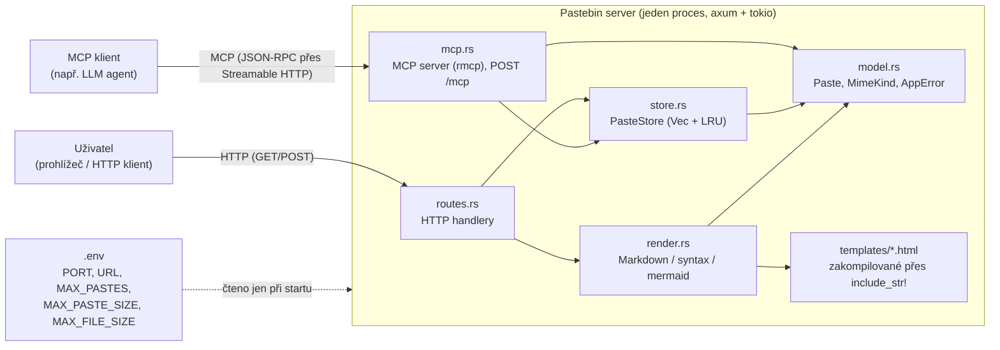

# Požadavky a analýza — Pastebin server

## 1. Doménový slovník (Ubiquitous Language)

| Pojem | Definice |
|---|---|
| **Paste** | Jedna uložená položka obsahu identifikovaná pomocí `Uuid` (`model::Paste`). Obsahuje binární data (`content: Vec<u8>`), typ obsahu (`mimetype`), počítadlo zobrazení (`hits`), časovou známku poslední aktivity (`last_seen_tick`) a volitelný původní název souboru (`file_name: Option<String>`, relevantní jen pro `OctetStream`). |
| **MimeKind** | Enum popisující typ obsahu pastu: `PlainText`, `Html`, `Markdown`, `OctetStream`. Řídí, jak se paste renderuje (strategy pattern přes `match`). |
| **PasteStore** | Sdílený stav aplikace držící všechny pasty ve `Vec<Paste>` (`store::PasteStore`). Vlastní i konfiguraci kapacity (`max_pastes`, `max_paste_size`) a globální generační počítadlo (`current_tick`). |
| **StyleStore** | Neměnná sada zdrojů pro renderování (`syntect::SyntaxSet`, `syntect::ThemeSet`), sdílená přes `Arc` bez zámku, protože se po startu aplikace nemění. |
| **AppState** | Kombinace `Arc<Mutex<PasteStore>>` a `Arc<StyleStore>`, předávaná do axum routeru přes `State`. |
| **Hits** | Počítadlo "životů" pastu (`u32`). Zvyšuje se při každém zobrazení (`record_view`), snižuje se o 1 při každém pokusu o evikci, dokud nedosáhne nuly. |
| **Tick (generace)** | Monotónně rostoucí `u64` čítač v `PasteStore` (`current_tick`). Zvyšuje se jak při vytvoření pastu, tak při každém zobrazení; hodnota se zapisuje do `last_seen_tick` daného pastu. Slouží k určení, který paste byl naposledy "viděn" nejdéle. |
| **Countdown LRU (decrement-LRU)** | Vlastní evikční algoritmus nad `Vec`: najde se paste s nejnižším `last_seen_tick` mezi zatím nevyřazenými kandidáty, jeho `hits` se sníží o 1; pokud klesnou na 0, paste se odstraní; pokud ne, kandidát se dočasně přeskočí (`skip_mask`) a hledá se další nejstarší, dokud se něco neuvolní. |
| **Kapacita (MAX_PASTES)** | Maximální počet pastů, které smí `PasteStore` držet současně. Konfigurováno přes `.env`. |
| **Limit velikosti textu (MAX_PASTE_SIZE)** | Maximální povolená velikost `content` pro textové mimetypy (`PlainText`, `Html`, `Markdown`) v bajtech. Konfigurováno přes `.env`. |
| **Limit velikosti souboru (MAX_FILE_SIZE)** | Maximální povolená velikost `content` pro `OctetStream` v bajtech — samostatná, typicky větší hodnota než `MAX_PASTE_SIZE`, protože binární soubory (obrázky, archivy) běžně přesahují to, co je rozumné pro textový paste. `PasteStore::insert` vybírá platný limit podle `mimetype`. |
| **file_name / sanitizace názvu souboru** | Volitelný původní název nahraného souboru u `OctetStream` pastů, uložený v `Paste.file_name`. `model::sanitize_file_name` ho očistí (odstraní řídicí znaky a uvozovky, ořízne na 255 znaků) a případně vrátí `None`. Používá se v `Content-Disposition` hlavičce při stažení (FR-19) i na náhledové stránce (FR-6a — jméno, případně detekce obrázku podle přípony přes `model::is_image_file_name`), přenáší se přes hlavičku `X-File-Name-B64` (HTTP, FR-17a) nebo argument `file_name` (MCP, FR-18). Na náhledové stránce se vkládá do HTML jen po escapování (`render::html_escape`, viz NFR-16). |
| **AppError** | Doménový chybový enum (`model::AppError`) implementující `IntoResponse`, mapující chyby na HTTP stavové kódy. |
| **Render strategie** | Funkce `render::render_paste_page`, která podle `MimeKind` vybere způsob vykreslení odpovědi (strategy pattern, žádné trait objekty). |
| **MCP server (PastebinMcp)** | Druhý protokolový adaptér nad stejnou doménou (`mcp::PastebinMcp`), vystavený na `POST /mcp` přes Streamable HTTP transport knihovny `rmcp`. Nesahá na `render.rs` — obsah pastů vrací jako surový text, ne vyrenderovaný HTML. |
| **Nástroj (tool)** | Jednotka funkcionality, kterou MCP server nabízí klientovi k zavolání (`tools/call` v JSON-RPC). Aktuálně `create_paste`, `create_binary_paste` a `get_paste`, definované metodami s `#[tool]` na `PastebinMcp`. |

## 2. Funkční požadavky

| ID | Požadavek |
|---|---|
| FR-1 | Systém umožní vytvořit nový paste odesláním JSON těla na `POST /paste/json` s poli `content: string` a `mimetype: MimeKind`. Odpověď obsahuje nově vygenerované `Uuid` pastu. |
| FR-2 | Systém umožní vytvořit nový paste odesláním `application/x-www-form-urlencoded` těla na `POST /paste/form` se stejnými poli jako FR-1. |
| FR-3 | Systém při vytvoření pastu vygeneruje náhodné `Uuid` (v4) a přidělí mu aktuální generaci (`current_tick`). |
| FR-4 | Systém zpřístupní existující paste na `GET /paste/{uuid}`. Pokud paste s daným UUID neexistuje (nikdy nevznikl nebo byl evikován), vrátí `404`. |
| FR-5 | Při každém úspěšném zobrazení pastu (FR-4) systém zvýší jeho `hits` o 1 a nastaví `last_seen_tick` na novou generaci (`record_view`). |
| FR-6 | Systém vykreslí obsah pastu podle `MimeKind`: `PlainText` → HTML stránka s escapovaným obsahem (viz FR-6b), ne `text/plain`; `Html` → HTML stránka s `<iframe>` obsahujícím obsah beze změny (viz FR-6c), ne přímo `text/html` na `GET /paste/{uuid}`; `Markdown` → převod na HTML; `OctetStream` → HTML náhledová stránka, ne přímo binární data (viz FR-6a). |
| FR-6a | Náhledová stránka `OctetStream` pastu (`templates/octet_stream.html`, `render::render_octet_stream_page`) zobrazí jméno souboru (`paste.file_name`, fallback `"{uuid}.bin"`) a velikost. Pokud přípona jména odpovídá obrázku (`model::is_image_file_name` — `png/jpg/jpeg/gif/webp/bmp/svg/ico`), vloží inline `` náhled; jinak zobrazí text "No preview available for this file type." Obojí doplněné tlačítkem Download vedoucím na FR-19. Jméno souboru se do HTML vkládá jen po escapování (NFR-16). |
| FR-6b | Stránka `PlainText` pastu (`templates/plain_text.html`, `render::render_plain_text_page`) zobrazí obsah uvnitř `<pre>` se zachovaným zalomením řádků (`white-space: pre-wrap`, dlouhé řádky se zalamují místo horizontálního scrollu). Obsah se do HTML vkládá jen po escapování (NFR-16). Na rozdíl od `OctetStream` (FR-19) nemá `PlainText` žádný `/raw` endpoint — přes HTTP tedy není cesta k syrovému textu bez HTML obalu, jen přes MCP `get_paste` (FR-16, stejná asymetrie jako u `Markdown`, viz otevřená otázka č. 16). |
| FR-6c | Stránka `Html` pastu (`templates/html_page.html`, `render::render_html_page`) obalí obsah do `<iframe src=".../raw">` s pevnou výškou (`80vh`, scrollbar uvnitř při delším obsahu). Do wrapperu se nevkládá nic z `paste.content` přímo (jen server-generovaná `/raw` URL), takže tu není potřeba escapování. `GET /paste/{uuid}/raw` u `Html` (FR-19) vrací obsah beze změny, bez sanitizace (NFR-7) — `<iframe>` je stejná origin jako zbytek aplikace, takže nedává žádnou skutečnou bezpečnostní izolaci, jen vizuální/layoutové oddělení (viz otevřená otázka č. 17). |
| FR-6d | Všechny čtyři stránkové šablony (`markdown.html`, `plain_text.html`, `octet_stream.html`, `html_page.html`) obsahují odkaz `← Back to home` vedoucí na `GET /`, stejným vizuálním stylem (`.back-link`/`.back-link:hover`). |
| FR-7 | Pro `Markdown` systém převede text na HTML pomocí `pulldown-cmark`, včetně základního formátování (nadpisy, tučné/kurzíva, seznamy, tabulky, přeškrtnutí, chytrá interpunkce, úkolové seznamy). |
| FR-8 | Uvnitř markdownu systém rozpozná blok kódu s jazykem a obarví ho pomocí `syntect` (motiv "Solarized (light)", inline styly). |
| FR-9 | Uvnitř markdownu systém rozpozná blok s jazykem `mermaid` a vyrenderuje ho na SVG pomocí `mermaid-svg`, vloženém přímo do výsledného HTML. Výsledný SVG se obalí do světlé karty (`.mermaid-diagram`), protože mermaid generuje tmavý text na průhledném pozadí, který by na tmavé stránce nebyl čitelný. |
| FR-9a | Vyrenderovaný `Markdown` se obalí do stránkové šablony `templates/markdown.html` (`render::render_markdown_page`) se stejnými CSS proměnnými (barvy, layout) jako `home.html` — konzistentní vzhled napříč aplikací. Blok kódu uvnitř markdownu se zvýrazní tmavým motivem `syntect` ("Solarized (dark)"), aby seděl na tmavé pozadí stránky. `PlainText`/`Html`/`OctetStream` mají od FR-6a/FR-6b/FR-6c vlastní analogické šablony, ne tuhle — každý mimetype má svou vlastní stránkovou funkci v `render.rs` (`render_paste_page` je jen dispatch, viz [ADR 0013](./adr/0013-html-iframe-wrapper.md)). |
| FR-10 | Systém zobrazí na `GET /` statickou domovskou stránku s formulářem pro vytvoření pastu a výběrem `mimetype`. Pro `PlainText`/`Html`/`Markdown` nabízí textové pole; pro `OctetStream` textové pole skryje a nabídne výběr souboru místo něj — buď kliknutím (systémový dialog), nebo přetažením (drag & drop) kdekoli na stránce, ne jen na malý vizuální box (`dragenter`/`dragover`/`drop` listenery na `document.body`). |
| FR-10a | ~~Po úspěšném vytvoření `OctetStream` pastu přes formulář na `GET /` frontend nenaviguje na `/paste/{uuid}`, ale zobrazí panel přímo na domovské stránce...~~ **Nahrazeno [ADR 0011](./adr/0011-octet-stream-preview-page.md).** `GET /paste/{uuid}` teď u `OctetStream` vrací HTML náhled (FR-6a), ne přímo bajty, takže po vytvoření pastu frontend beze změny naviguje na `/paste/{uuid}` pro všechny mimetypy — dřívější `success-panel` workaround z [ADR 0009](./adr/0009-original-file-name-preservation.md) přestal být potřeba a byl z `home.html` odstraněn. |
| FR-11 | Pokud počet pastů v `PasteStore` dosáhne `max_pastes`, systém před vložením nového pastu provede countdown LRU evikci (viz doménový slovník), dokud se neuvolní alespoň jedno místo. |
| FR-12 | Systém odmítne vytvoření pastu s prázdným `content` (`AppError::BadRequest`, `400`) — platí pro všechny mimetypy včetně `OctetStream`/prázdného souboru. |
| FR-13 | Systém odmítne vytvoření pastu, jehož `content` přesahuje limit platný pro jeho `mimetype` (`AppError::PayloadTooLarge`, `413`) — `max_paste_size` pro `PlainText`/`Html`/`Markdown`, `max_file_size` pro `OctetStream` (viz FR-17). |
| FR-14 | Systém odmítne request s neplatnou hodnotou `mimetype` (nerozpoznaný enum variant) už na úrovni deserializace (axum/serde), bez zásahu do stavu úložiště. |
| FR-15 | Systém vystaví MCP server na `POST /mcp` (Streamable HTTP transport, `rmcp`) s nástrojem `create_paste(content, mimetype)`, který vytvoří nový textový paste (`PlainText`/`Html`/`Markdown`) stejnou cestou jako FR-1/FR-2 (`PasteStore::insert`) a vrátí jeho UUID jako textový výsledek nástroje. |
| FR-16 | MCP server nabízí nástroj `get_paste(id)`, který zobrazí paste podle UUID se stejným vedlejším efektem jako FR-5 (`PasteStore::record_view` — inkrementace `hits`, aktualizace `last_seen_tick`). Textový obsah (`PlainText`, `Html`, `Markdown`) se vrací surový, bez renderování; `OctetStream` obsah se popíše jen počtem bajtů, protože binární data nejdou vložit jako text (viz FR-18 a otevřená otázka č. 10). |
| FR-17 | Systém umožní vytvořit paste typu `OctetStream` odesláním syrových binárních dat jako těla requestu na `POST /paste/binary` (extraktor `axum::body::Bytes`, bez JSON/base64 obálky). Mimetype je pro tento endpoint vždy `OctetStream`, žádné další pole se neposílá. Na rozdíl od `POST /paste/json`/`POST /paste/form` (kde `content` musí být validní UTF-8 text, protože prochází `String`) tento endpoint podporuje libovolná binární data. |
| FR-17a | `POST /paste/binary` volitelně přijme hlavičku `X-File-Name-B64` s původním názvem souboru, base64 zakódovaným (hlavičky jsou ASCII-only, název souboru může být libovolný Unicode). Po dekódování projde `model::sanitize_file_name` a uloží se do `Paste.file_name`. Chybějící nebo nevalidní hlavička (špatný base64, prázdný název po sanitizaci) vede tiše k `file_name: None`, ne k chybě requestu — viz FR-6 pro použití při zobrazení. |
| FR-18 | MCP server nabízí nástroj `create_binary_paste(content_base64, file_name?)`, který base64 dekóduje `content_base64` a vytvoří paste typu `OctetStream` — MCP obdoba FR-17/FR-17a pro protokol, kde argumenty nástroje jsou vždy JSON (a JSON string musí být validní Unicode text, nejde do něj vložit syrové bajty přímo). Volitelný `file_name` (prostý string, žádné kódování navíc potřeba) projde stejnou `sanitize_file_name` funkcí jako FR-17a a uloží se do `Paste.file_name`. Nesprávný base64 vrátí `isError: true` s popisnou chybou, ne pád serveru. |
| FR-19 | Systém zpřístupní `GET /paste/{uuid}/raw` pro mimetypy, jejichž "raw" forma se liší od jejich hlavní stránky (`render::render_raw_content` dispatcher): `OctetStream` — `Content-Type: application/octet-stream`, `Content-Disposition: attachment; filename="..."` (`paste.file_name`, fallback `"{uuid}.bin"`), použito jako cíl tlačítka Download i jako `src` obrázkového náhledu z FR-6a (funguje pro obojí, protože `attachment` hlavičku prohlížeče vynucují jen při navigaci, ne při fetchi subresource jako ``); `Html` — `Content-Type: text/html`, obsah beze změny, **bez** `Content-Disposition` (slouží jako `<iframe>` zdroj pro FR-6c, ne ke stažení). `PlainText`/`Markdown` na `/raw` vrátí `404` (`AppError::NotFound`) — nemají žádnou raw formu odlišnou od vlastní stránky (viz otevřená otázka č. 16). Na rozdíl od FR-5/FR-6 se `/raw` nikdy nepočítá jako "zobrazení" — čte se přes read-only `PasteStore::get`, ne `record_view`, takže `hits`/`last_seen_tick` se nezvyšují (viz [ADR 0011](./adr/0011-octet-stream-preview-page.md), [ADR 0013](./adr/0013-html-iframe-wrapper.md)). |

## 3. Nefunkční požadavky (NFR)

| ID | Požadavek | Poznámka |
|---|---|---|
| NFR-1 | Kapacita úložiště je konfigurovatelná přes `MAX_PASTES` v `.env`; aktuální provozní hodnota je `100`. | Hodnota není zadrátovaná v kódu, čte se za běhu v `main.rs`. |
| NFR-2 | Maximální velikost textového pastu (`PlainText`/`Html`/`Markdown`) je konfigurovatelná přes `MAX_PASTE_SIZE`; aktuální provozní hodnota je `1 048 576` B (1 MiB). Maximální velikost binárního souboru (`OctetStream`) je konfigurovatelná samostatně přes `MAX_FILE_SIZE`; aktuální provozní hodnota je `20 971 520` B (20 MiB). `PasteStore::insert` vybírá platný limit podle `mimetype`. | Viz Otevřené otázky — u `POST /paste/json`/`POST /paste/form` se limit stále vynucuje na dvou různých místech s mírně odlišnou definicí "velikosti"; u `POST /paste/binary` (FR-17) tento nesoulad neplatí, protože tělo requestu je přímo obsah bez JSON/form obálky. |
| NFR-3 | Úložiště je čistě v paměti (`Vec<Paste>` v `PasteStore`, chráněný `Arc<Mutex<...>>`); žádná perzistence na disk ani do databáze. Restart procesu znamená ztrátu všech pastů. | Záměrné rozhodnutí, ne nedodělek — odpovídá zadání ("no persistence required"). |
| NFR-4 | Datová struktura pro úložiště smí být výhradně `Vec` — žádné `HashMap`, `BTreeMap`, `VecDeque`, `HashSet` ani prioritní fronta, a to i pro pomocné bookkeeping struktury uvnitř evikčního algoritmu (`skip_mask: Vec<bool>` místo množiny indexů). | Vyhledání pastu podle UUID je lineární, `O(n)`. |
| NFR-5 | Souběžný přístup je řešen jediným `std::sync::Mutex` kolem `PasteStore`; `StyleStore` (syntect zdroje) je neměnný a sdílený bez zámku. | Zámek se drží jen po dobu čtení/zápisu do `Vec`, ne po dobu renderování (renderovací funkce už zámek nedrží). |
| NFR-6 | Časová složitost jednoho volání `find_last_seen_paste` je `O(n)` (lineární sken s `O(1)` kontrolou přeskočení přes `skip_mask`); jedna evikční operace (`process_full_capacity`) může v nejhorším případě zavolat `find_last_seen_paste` opakovaně, tedy až `O(n²)`. | Relevantní pro rozhodování o horní hranici `MAX_PASTES` — desítky tisíc a více položek by evikci znatelně zpomalily. |
| NFR-7 | Žádná sanitizace HTML obsahu u `MimeKind::Html` pastů — obsah se vrací beze změny na `GET /paste/{uuid}/raw` (FR-19), zobrazený v `<iframe>` na hlavní stránce (FR-6c). | Záměrné zjednodušení dle zadání, ne opomenutí — má bezpečnostní důsledky, viz NFR-9. Požadavek "beze změny" se od [ADR 0013](./adr/0013-html-iframe-wrapper.md) týká `/raw`, ne přímo `GET /paste/{uuid}`. |
| NFR-8 | Žádná autentizace, autorizace ani rate-limiting nad endpointy. | Kdokoli s přístupem k serveru může vytvářet i číst libovolné pasty, pokud zná/uhodne UUID. |
| NFR-9 | `MimeKind::Html` pasty jsou bezpečnostně ekvivalentní neomezenému stored-XSS vektoru — kdokoli může vytvořit paste s libovolným JavaScriptem, který se spustí v kontextu domény serveru při zobrazení. | Přijatelné riziko pro cvičný/interní provoz, nevhodné pro veřejný provoz bez dalších opatření. |
| NFR-10 | Formální SLA pro latenci (např. p50/p99) není měřeno ani testováno. | Otevřený bod — viz kapitola 6. |
| NFR-11 | Automatizované pokrytí testy: 22 unit testů (`src/store.rs`, `src/render.rs`) + 25 integračních testů (`tests/routes_test.rs`) = 47 testů, spouštěných přes `cargo test`. | Pokrývají hraniční případy LRU (kapacita 1, prázdný store, remíza v ticku, vícekolová dekrementace), rendering (markdown, syntax highlighting, mermaid, `Content-Disposition` s vlastním i fallback názvem souboru), stránku `PlainText` (HTML obal, escapování obsahu — FR-6b/NFR-16), iframe wrapper a beze-změny `/raw` u `Html` (FR-6c/FR-19), náhledovou stránku `OctetStream` (obrázkový náhled, fallback bez náhledu, escapování názvu souboru — FR-6a/NFR-16), `GET /paste/{uuid}/raw` (bajty, 404 pro `PlainText`/`Markdown`, nezvyšuje `hits`/`last_seen_tick` — FR-19), HTTP vrstvu (vytvoření, zobrazení pro všechny 4 mimetypy, 404, 413, 400, 422) a `POST /paste/binary` včetně roundtripu s reálnými nevalidními-UTF8 bajty (FR-17) a zachování/sanitizace/fallbacku názvu souboru přes `X-File-Name-B64` (FR-17a). Funkčnost MCP endpointu (FR-15, FR-16, FR-18) je zatím ověřená jen manuálně (viz AC-12, AC-13, AC-14), ne automatizovaným testem. |
| NFR-12 | `POST /mcp` sdílí stejný `AppState`/`PasteStore` jako HTTP vrstva — žádný oddělený stav ani perzistence. Správa MCP session (`LocalSessionManager`) je taky čistě v paměti procesu, ztrácí se při restartu stejně jako pasty. | Rozšiřuje NFR-3 i na MCP vrstvu. |
| NFR-13 | Na `POST /mcp` platí stejná absence autentizace/autorizace/rate-limitingu jako na HTTP endpointech. | Rozšiřuje NFR-8/NFR-9 — kdokoli s přístupem k `/mcp` může přes nástroj `create_paste` vytvořit paste typu `Html` se stejným XSS rizikem jako přes `POST /paste/json`. |
| NFR-14 | CI (`.github/workflows/ci.yml`, GitHub Actions) spustí `cargo build` + `cargo test` na každý `push`/`pull_request` do `main`. | Viz [ADR 0010](./adr/0010-github-actions-ci-docker-image.md) a otevřená otázka č. 12 — nic v repozitáři samo o sobě nevynucuje "merge jen po zeleném CI", to vyžaduje ruční branch protection v GitHub Settings. |
| NFR-15 | Aplikace je distribuovatelná jako Docker image (`Dockerfile`, multi-stage build) — po `push` do `main` se automaticky sestaví a publikuje do `ghcr.io/<owner>/<repo>` (tagy `latest` + zkrácené SHA). Konfigurace (`URL`, `PORT`, `MAX_PASTES`, `MAX_PASTE_SIZE`, `MAX_FILE_SIZE`) se do kontejneru předává přes `docker run -e ...`, `.env` soubor se do image nezapíná. | Viz [ADR 0010](./adr/0010-github-actions-ci-docker-image.md) a otevřená otázka č. 13 — nově publikovaný GHCR balíček je defaultně private. Žádný `docker-compose.yml` — aplikace nemá žádné další služby k orchestraci (viz NFR-3). |
| NFR-16 | `render::html_escape` (`& < > " '`) chrání dvě místa, kde se uživatelem kontrolovaná data vkládají do HTML šablony: `paste.file_name` na náhledové stránce `OctetStream` (FR-6a, viditelný text i ``) a `paste.content` na stránce `PlainText` (FR-6b). | Nový, jinak nehlídaný vektor stored-XSS pro oba mimetypy — soubor nazvaný `.png`, nebo `PlainText` paste s obsahem ``, by se jinak vykonal v prohlížeči diváka. Odlišné od NFR-9 (tam je XSS u `MimeKind::Html` záměrně nefiltrovaný obsah pastu samotného — explicitní požadavek, ne opomenutí). |

## 4. Akceptační kritéria

Scénáře odkazují na funkční požadavky výše. Formát Given/When/Then.

**AC-1 — Vytvoření pastu přes JSON (FR-1, FR-3)**
Given prázdný `PasteStore`,
When klient pošle `POST /paste/json` s `{"content": "ahoj", "mimetype": "PlainText"}`,
Then odpověď má status `200` a tělo obsahuje validní `Uuid`, který odpovídá nově vloženému pastu ve store.

**AC-2 — Vytvoření pastu přes form (FR-2)**
Given prázdný `PasteStore`,
When klient pošle `POST /paste/form` s `content=ahoj&mimetype=PlainText`,
Then odpověď má status `200` a tělo obsahuje validní `Uuid` odpovídající uloženému pastu.

**AC-3 — Zobrazení neexistujícího pastu (FR-4)**
Given `PasteStore` neobsahuje paste s daným UUID,
When klient pošle `GET /paste/{náhodné-uuid}`,
Then odpověď má status `404`.

**AC-4 — Zobrazení aktualizuje hits a tick (FR-5)**
Given existující paste s `hits = 0`,
When klient jednou zavolá `GET /paste/{uuid}`,
Then `hits` pastu je `1` a `last_seen_tick` je vyšší než při vytvoření (aktuální implementace: tick se spotřebovává jak při vytvoření, tak při zobrazení, takže první zobrazení posune tick z `1` na `2`).

**AC-5 — Renderování podle mimetype (FR-6, FR-7, FR-8, FR-9)**
Given paste s `mimetype: Markdown` a obsahem obsahujícím nadpis, blok kódu s jazykem a blok `mermaid`,
When klient zavolá `GET /paste/{uuid}`,
Then odpověď má `Content-Type: text/html; charset=utf-8` a tělo obsahuje jak vygenerovaný nadpis (`<h1>...</h1>`), tak inline styl ze `syntect` (`style="color:`), tak validní `<svg>...</svg>` blok.

**AC-5a — `PlainText` stránka a escapování (FR-6, FR-6b)**
Given paste s `mimetype: PlainText` a obsahem obsahujícím HTML-speciální znaky (např. ``) a odřádkování,
When klient zavolá `GET /paste/{uuid}`,
Then odpověď má `Content-Type: text/html; charset=utf-8` (ne `text/plain`), tělo obsahuje escapovanou verzi obsahu (`&lt;script&gt;...`), ne syrový tag, a zalomení řádků z originálu zůstává zachované.

**AC-5b — `Html` iframe wrapper a beze-změny `/raw` (FR-6, FR-6c, FR-19)**
Given paste s `mimetype: Html` a obsahem obsahujícím ``,
When klient zavolá `GET /paste/{uuid}`,
Then odpověď má `Content-Type: text/html; charset=utf-8`, tělo obsahuje `<iframe src="/paste/{uuid}/raw">`, ale **neobsahuje** uživatelův obsah/script přímo.
When klient zavolá `GET /paste/{uuid}/raw`,
Then tělo je byte-přesně identické originálu — žádná sanitizace, ``,
When klient zavolá `GET /paste/{uuid}`,
Then tělo obsahuje escapovanou verzi (`&lt;script&gt;`), ne syrový tag.

**AC-11e — `GET /paste/{uuid}/raw` nepočítá se jako zobrazení (FR-19)**
Given existující `OctetStream` paste s `hits = 0`,
When klient třikrát zavolá `GET /paste/{uuid}/raw`,
Then `hits` pastu zůstává `0` a `last_seen_tick` se nezmění — na rozdíl od `GET /paste/{uuid}` (FR-5). Pro neexistující/evikovaný paste vrátí `GET /paste/{uuid}/raw` `404` stejně jako FR-4.

**AC-11f — `/raw` nedostupné pro `PlainText`/`Markdown` (FR-19)**
Given existující paste s `mimetype: PlainText` (nebo `Markdown`),
When klient zavolá `GET /paste/{uuid}/raw`,
Then odpověď má status `404` — tyto typy nemají žádnou raw formu odlišnou od vlastní stránky, `/raw` proto nespadne do nějakého nesmyslného fallbacku (např. `application/octet-stream`).

**AC-12 — Vytvoření pastu přes MCP nástroj (FR-15)**
Given inicializovaná MCP session na `POST /mcp` (po `initialize` handshake),
When klient zavolá `tools/call` s `name: "create_paste"` a argumenty `{"content": "ahoj", "mimetype": "PlainText"}`,
Then odpověď má `isError: false` a textový obsah je validní `Uuid`, který odpovídá pastu skutečně vloženému do `PasteStore` — ověřitelné i přes `GET /paste/{uuid}` na stejném UUID.

**AC-13 — Zobrazení pastu přes MCP nástroj (FR-16)**
Given existující paste vytvořený přes `create_paste` (nebo běžné HTTP endpointy),
When klient zavolá `tools/call` s `name: "get_paste"` a `{"id": "<uuid>"}`,
Then odpověď má `isError: false`, textový obsah ve tvaru `"[Mimetype] obsah"` a `hits`/`last_seen_tick` pastu se aktualizují stejně, jako by šlo o `GET /paste/{uuid}`. Neplatný formát UUID (`isError: true`, "Neplatné UUID: ...") i neexistující/evikovaný paste (`isError: true`, "NotFound") vrátí chybu v těle JSON-RPC odpovědi, ne pád serveru ani HTTP chybový status.

**AC-14 — Vytvoření binárního pastu přes MCP nástroj (FR-18)**
Given inicializovaná MCP session na `POST /mcp`,
When klient zavolá `tools/call` s `name: "create_binary_paste"` a `{"content_base64": "<base64 kódování bajtů, které nejsou validní UTF-8>", "file_name": "photo.png"}`,
Then odpověď má `isError: false` a textový obsah je validní `Uuid`; následné `GET /paste/{uuid}/raw` vrátí `Content-Type: application/octet-stream`, bajt-po-bajtu identický obsah jako před base64 zakódováním a `Content-Disposition: attachment; filename="photo.png"`. `file_name` je nepovinný (bez něj platí fallback `"{uuid}.bin"`, FR-19) a neplatný base64 v `content_base64` vrátí `isError: true` s popisnou chybou.

## 5. Hranice systému

**Uvnitř systému:** HTTP vrstva (routes.rs), MCP vrstva (mcp.rs) jako druhý protokolový adaptér nad stejnou doménou, doménová logika a úložiště (store.rs, model.rs), rendering (render.rs, používá jen `routes.rs`, ne `mcp.rs`), statické HTML šablony zakompilované do binárky.

**Mimo systém / závislosti:**
- `.env` soubor — čten jednorázově při startu (`main.rs`), za běhu se neobnovuje.
- Žádná databáze, žádná externí síťová služba, žádné volání ven (rendering mermaidu i syntect, i zpracování MCP protokolu, probíhá čistě in-process, bez síťové komunikace ven).
- `syntect` načítá výchozí (vestavěné) sady syntaxí a motivů do paměti při vytvoření `StyleStore`, žádné externí soubory za běhu.
- MCP klient (např. LLM agent) je externí aktér stejně jako uživatel v prohlížeči — komunikuje s tím samým procesem, jen jiným protokolem/endpointem.

**Rozhraní systému:**
- `GET /`
- `POST /paste/json`
- `POST /paste/form`
- `POST /paste/binary` (syrové binární tělo, bez JSON/form obálky — viz FR-17)
- `GET /paste/{uuid}` (u `OctetStream`/`Html` HTML stránka, ne přímo bajty — viz FR-6a/FR-6c)
- `GET /paste/{uuid}/raw` (syrová data `OctetStream`/`Html` pastu; `404` pro `PlainText`/`Markdown` — viz FR-19)
- `POST /mcp` (Model Context Protocol, Streamable HTTP transport — JSON-RPC)

## 6. Otevřené otázky

1. **Jeden vs. tři POST endpointy.** Zadání popisuje jediný `POST /paste`, který rozlišuje formát podle `Content-Type`. Aktuální implementace má tři oddělené endpointy (`/paste/json`, `/paste/form`, `/paste/binary` — poslední přibyl kvůli FR-17, protože binární data nejdou vyjádřit jako JSON/form string). Sjednotit podle `Content-Type` do jednoho `POST /paste`, nebo ponechat rozdělené?
2. **Dva různé metry pro limit velikosti — už jen u `POST /paste/json`/`POST /paste/form`.** `DefaultBodyLimit::max(max_paste_size.max(max_file_size))` v `routes::create_router` měří syrové tělo HTTP requestu (včetně JSON/form obálky), zatímco `Paste::new` měří jen dekódovaný `content.len()`. Paste s textovým obsahem přesně na hranici `MAX_PASTE_SIZE` může být odmítnut vrstvou `DefaultBodyLimit` dřív, než se dostane k aplikační validaci — efektivní limit je tak o něco nižší, než `MAX_PASTE_SIZE` deklaruje. U `POST /paste/binary` (FR-17) tento nesoulad neexistuje, protože tělo requestu je přímo obsah, žádná obálka navíc. Sjednotit kontroly u JSON/form endpointů na stejnou definici "velikosti", nebo nechat jak je?
3. **Nepoužitá šablona.** `templates/paste.html` (s placeholdery `{{NAME}}`, `{{ID}}`, `{{CONTENT}}`) není nikde v kódu použita — `render_paste_page` u `Html`/`Markdown` vrací obsah přímo, bez obalení do stránkové šablony. Smazat soubor, nebo dopracovat jednotný vzhled i pro zobrazení pastu?
4. **Neměřené NFR.** Guide vyžaduje měřitelná NFR pro latenci a propustnost (např. p99 < X ms při Y RPS). Taková čísla zatím nebyla naměřena ani formalizována jako testovatelný požadavek.
5. **Zápis hits/ticku před úspěšným renderem.** `record_view` (store.rs) zapíše `hits`/`last_seen_tick` ještě před tím, než `render_paste_page` prokazatelně uspěje. Pokud rendering markdownu následně selže (`MarkdownParserFailed`, `MermaidRenderError`), počítadlo zobrazení se přesto zvýšilo. Je to žádoucí sémantika ("pokus o zobrazení" = "zobrazení"), nebo by měl zápis proběhnout až po úspěšném vyrenderování?
6. **Nerealizované bonusové funkce ze zadání.** Endpoint pro smazání pastu a časová expirace nejsou implementovány.
7. **MCP server se v `initialize` odpovědi hlásí jako `{"name":"rmcp","version":"3.1.4"}`.** Vlastní `get_info()` v `mcp.rs` nepředává `ServerInfo` explicitní jméno/verzi projektu (`Implementation::new("pastebin", ...)`), takže se v `serverInfo` propíše výchozí identifikace `rmcp` crate, ne tohoto projektu. Kosmetická nepřesnost, na funkčnost nemá vliv.
8. **`get_paste` přes MCP vrací u `Markdown` surový zdroj, ne vyrenderované HTML** — záměrná odchylka od `GET /paste/{uuid}` (FR-6/FR-7), protože pro MCP/LLM klienta je čitelnější syrový text než HTML blob. Stálo by za úvahu, jestli časem nepřidat i variantu/parametr pro vyrenderovaný výstup, kdyby ho MCP klient chtěl.
9. **MCP endpoint zatím nemá automatizované testy** (na rozdíl od HTTP vrstvy, viz NFR-11) — funkčnost byla ověřena jen manuálně přes reálné JSON-RPC requesty.
10. **Zápis binárních dat přes MCP je řešen (FR-18), čtení ne — asymetrie.** `create_binary_paste` umí přijmout libovolná binární data (base64), ale `get_paste` u `OctetStream` obsahu stále jen vrátí počet bajtů, ne samotný obsah — MCP klient si binární paste nemůže přes `get_paste` stáhnout, musí sáhnout na `GET /paste/{uuid}` přes běžný HTTP klient mimo MCP. Symetrické řešení by bylo `get_paste` u `OctetStream` vracet obsah taky jako base64 (stejný vzor jako `image`/`blob` content bloky v samotné MCP specifikaci).
11. ~~Přímý odkaz na `OctetStream` paste pořád jen stáhne soubor, bez viditelné stránky.~~ **Vyřešeno v [ADR 0011](./adr/0011-octet-stream-preview-page.md)** — `GET /paste/{uuid}` teď obecně (ne jen po vytvoření přes formulář) vrací HTML náhledovou stránku (FR-6a), syrová data se přesunula na `GET /paste/{uuid}/raw` (FR-19). `success-panel` hack z FR-10a/ADR 0009 díky tomu odpadl.
12. **CI nic nevynucuje na úrovni repozitáře (NFR-14, [ADR 0010](./adr/0010-github-actions-ci-docker-image.md)).** Workflow se spustí a nahlásí status, ale bez zapnutí branch protection rules v GitHub Settings (mimo verzovaný kód) nic nebrání mergi do `main` i se selhávajícím CI.
13. **GHCR balíček je po prvním publikování private (NFR-15, [ADR 0010](./adr/0010-github-actions-ci-docker-image.md)).** Stažení `ghcr.io/<owner>/<repo>` bez přihlášení (`docker login`) vyžaduje ruční změnu viditelnosti balíčku na public v Package settings. Zároveň `docker` job v pipeline zatím publikuje jen tagy `latest`/SHA při každém push do `main`, žádné sémantické verzování podle release tagů.
14. **Náhled `OctetStream` pastů je jen pro obrázky (FR-6a, [ADR 0011](./adr/0011-octet-stream-preview-page.md)).** Video/audio přes `<video>`/`<audio>` by šlo doplnit stejným vzorem jako `` (subresource fetch, `Content-Disposition: attachment` na `/raw` nevadí). PDF přes `<iframe>` by byl problematičtější — iframe navigace `attachment` hlavičku typicky respektuje, takže by to vynutilo stažení/prázdný frame místo náhledu, dokud by `/raw` neuměl vracet `inline` variantu (např. přes query parametr).
15. **Detekce "je to obrázek" je heuristika podle přípony, ne skutečný sniff bajtů (FR-6a, `model::is_image_file_name`).** Vychází čistě z `file_name` (uživatelem zadaný/nahraný název), ne z reálného obsahu souboru. Přejmenovaný nesouborový obsah na `.png` se pokusí zobrazit jako ``, ale nezpůsobí žádnou chybu — pokud bajty nejsou platný obrázek, prohlížeč jen nic nevykreslí (rozbitá ikona).
16. **`PlainText` a `Markdown` nemají HTTP cestu k syrovému obsahu, na rozdíl od `OctetStream`/`Html` (FR-6b, FR-19, [ADR 0012](./adr/0012-plain-text-html-page.md)).** `GET /paste/{uuid}` u obou vrací jen HTML stránku; syrový text jde získat výhradně přes MCP nástroj `get_paste` (FR-16), ne přes běžný HTTP klient (`curl` apod.). Sjednotit přidáním `/raw` i pro tyto dva mimetypy (stejný vzor jako FR-19), nebo tuhle asymetrii nechat, protože MCP už tuhle potřebu pokrývá?
17. **`<iframe>` u `Html` (FR-6c, [ADR 0013](./adr/0013-html-iframe-wrapper.md)) nedává žádnou skutečnou bezpečnostní izolaci.** Je to stejná origin jako zbytek aplikace, takže JS uvnitř pastu se pořád může dostat na `window.top`/`parent` a ovlivnit celou stránku — stejné riziko jako dřív (žádná regrese), ale taky žádný bezpečnostní přínos, jen vizuální/layoutové oddělení. Skutečná izolace by vyžadovala `sandbox` atribut na `<iframe>` (což by ale omezilo i legitimní JS v pastu, viz NFR-9) nebo servírování `/raw` z jiné origin/subdomény — mimo současný rozsah.
18. **Pevná výška `<iframe>`u u `Html` (FR-6c) se nepřizpůsobuje obsahu.** Krátký paste nechá pod obsahem prázdné místo, dlouhý bude scrollovat uvnitř `80vh` okna. Auto-resize podle skutečné výšky obsahu (čtení `contentWindow.document.body.scrollHeight`, funguje bez `postMessage` díky stejné origin) byl zvažován, ale vědomě zamítnut ve prospěch jednoduššího řešení.
